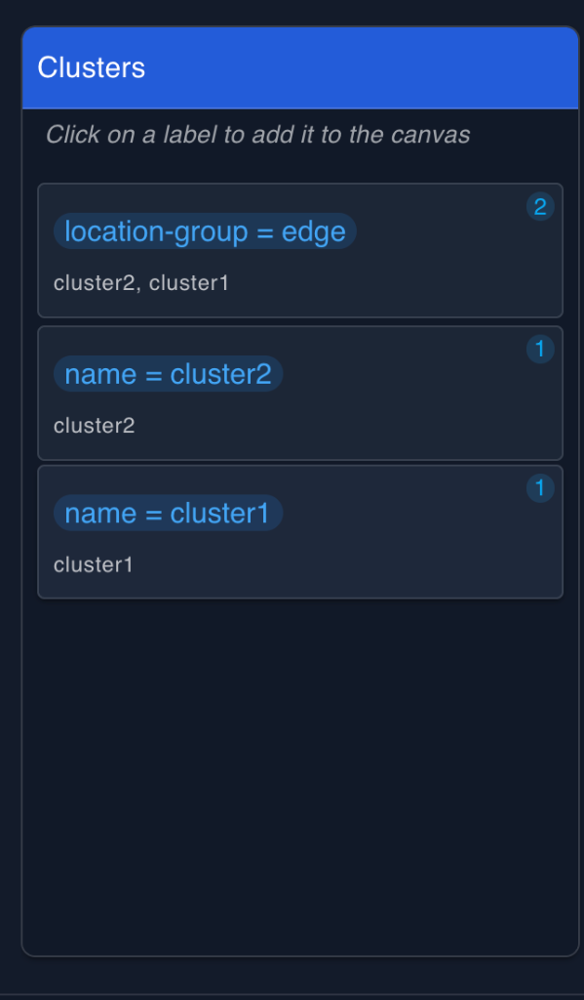
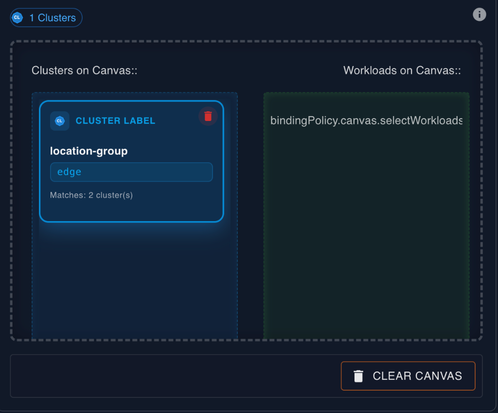
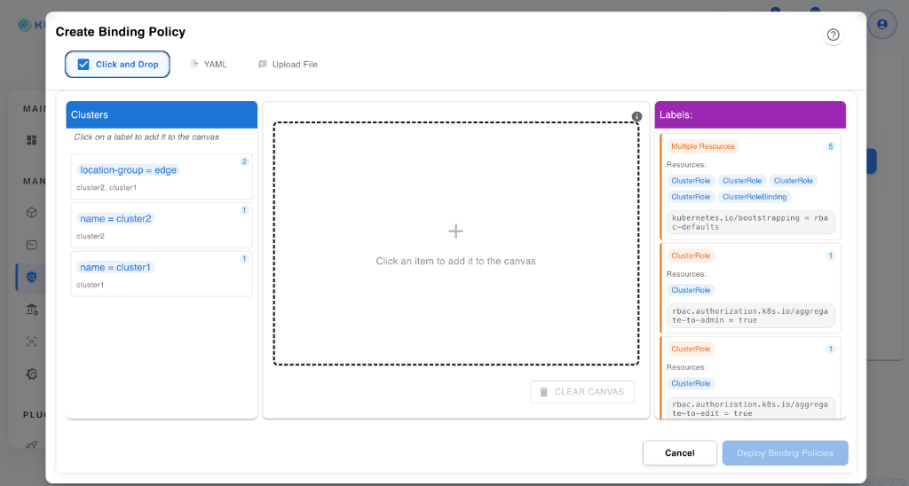
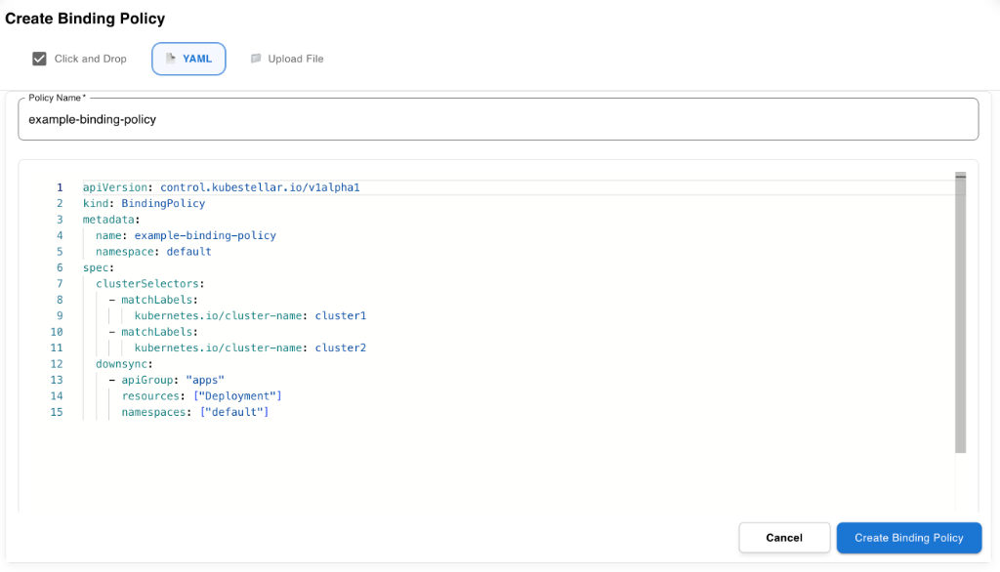
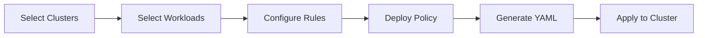
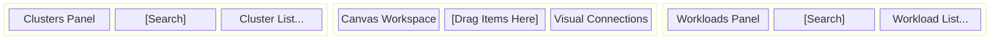
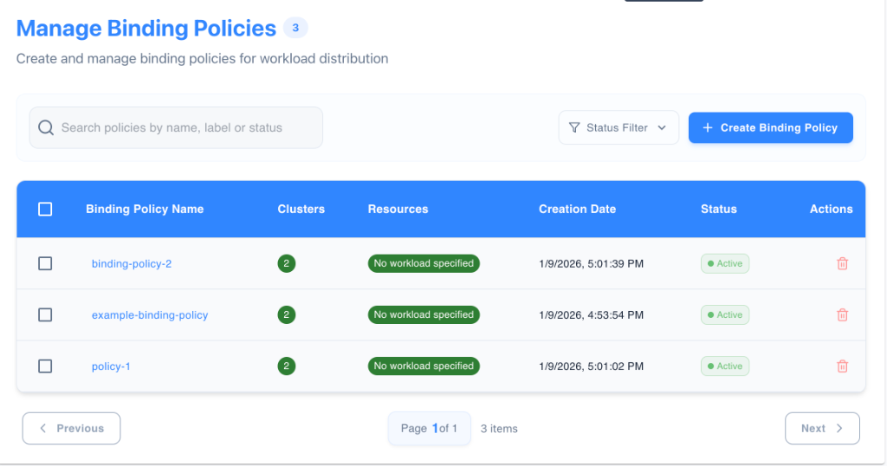
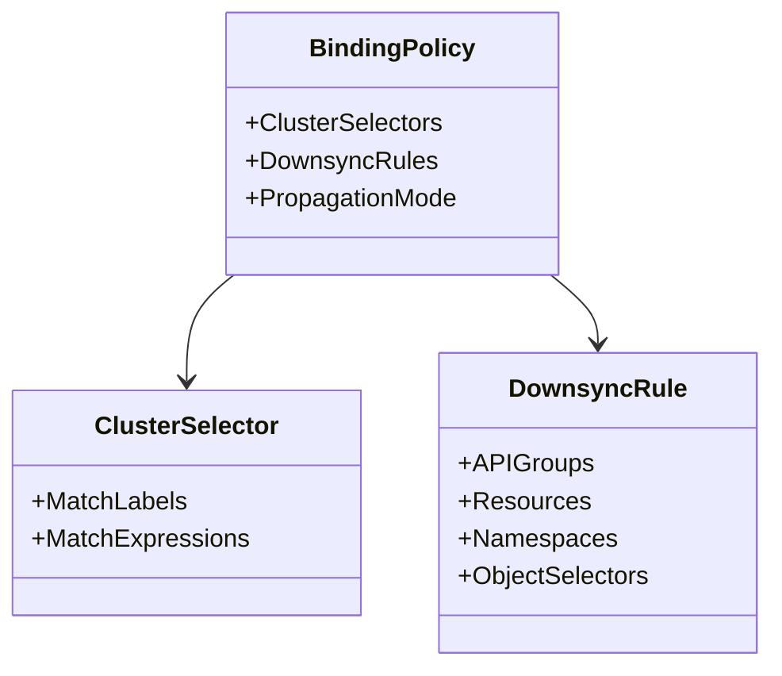
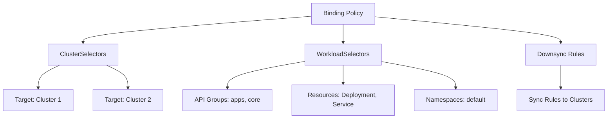

# Binding Policy Management

The **Binding Policy (BP)** component is the heart of KubeStellar's multi-cluster deployment capability. It allows users to define explicit rules for *what* (workloads) gets deployed *where* (clusters) and *how* (configuration).

This guide covers the visual policy builder, the drag-and-drop interface, policy creation workflows, and advanced management features.

Binding Policies (BP) solve the "Where is my code?" problem in massive multi-cluster environments. Instead of manually targeting Cluster A or Cluster B, KubeStellar uses an Intent-Based Networking model. You define the intent (e.g., "All clusters in US-East with a PCI-compliance label should run the Payment-Gateway workload"), and KubeStellar handles the heavy lifting of reconciliation.

This approach offers three major benefits:

*   **Scalability**: As you add 100 more edge clusters, if they carry the correct labels, policies apply to them automatically without manual intervention.
*   **Consistency**: By using `matchExpressions`, you ensure that dev, staging, and prod environments stay synchronized based on their lifecycle tags.
*   **Observability**: The visual builder provides a real-time topology map, turning abstract YAML into a visible relationship graph between your infrastructure and your applications.

## Prerequisites

Before creating binding policies, ensure you have:

*   **Imported Clusters**: Clusters registered in the Inventory Transfer Storage (ITS) with appropriate labels.
*   **Created Workloads**: Workload objects (Deployments, Services, CRDs, etc.) available in the Workload Description Space (WDS).
*   **Labeling Strategy**: A clear understanding of your label taxonomy for both clusters and workloads, as KubeStellar relies heavily on label selectors.

## Feature Overview

*   **Visual Policy Builder**: A three-panel drag-and-drop interface to intuitively map workloads to clusters.
*   **Flexible Selection**: Select resources individually or dynamically using label selectors.
*   **Interactive Visualization**: View relationships between policies, workloads, and clusters in Radial, Horizontal, or Vertical graph layouts.
*   **Real-time Status**: Monitor the reconciliation status of your policies instantly.
*   **Advanced Configuration**: Fine-tune downsync rules, propagation modes, and update strategies.

---

## Visual Policy Builder Interface

The Visual Policy Builder provides a unified workspace for defining binding policies without writing complex YAML manually.

### Three-Panel Layout


The interface is divided into three distinct zones:

#### 1. Left Panel: Clusters

Displays all available managed clusters from the ITS.
*   **Search & Filter**: Find clusters by name or labels.
*   **Status Indicators**: See the connection status (Ready/NotReady) of each cluster.
*   **Drag & Drop**: Drag individual clusters or groups of clusters (via labels) to the center canvas.
*   **Metrics**: View basic capacity metrics (CPU, Memory) for informed placement decisions.

#### 2. Center Panel: Canvas Workspace

The active staging area for your policy.
*   **Visual Connections**: Automatically draws lines between dropped clusters and workloads to indicate potential bindings.
*   **Clear & Reset**: Easily remove items or clear the entire canvas to start over.
*   **Context Menus**: Right-click items to remove them or view details.
*   **Empty State**: Provides clear instructions and drop zones when starting a new policy.

#### 3. Right Panel: Workloads
Displays all available workload objects from the WDS.
*   **Namespace Filtering**: Filter workloads by namespace (default is filtered out by default).
*   **Kind Filtering**: Filter by resource Kind (Deployment, Service, ConfigMap, etc.).
*   **Drag & Drop**: Drag specific workloads or label-based groups to the canvas.

## Policy Creation Workflow

### Step 1: Select Clusters
1.  Navigate to the **Clusters Panel** on the left.
2.  **Search** for specific clusters or use the filter to find clusters by label (e.g., `location=edge`).
3.  **Drag** the desired clusters onto the central Canvas.
    *   *Tip:* Dragging a label group will dynamically select all current and future clusters with that label.

### Step 2: Select Workloads
1.  Navigate to the **Workloads Panel** on the right.
2.  **Search** for the application resources you want to deploy.
3.  **Drag** the workloads onto the central Canvas.
    *   *Tip:* You can select related resources (e.g., a Deployment and its Service) together.

### Step 3: Configure & Deploy
1.  Once items are on the canvas, click the **Deploy** button.
2.  **Name Your Policy**: Enter a unique name for the Binding Policy.
    
3.  **Review Configuration**:
    *   The system automatically generates the Binding Policy YAML.
    *   **Downsync Rules**: Verify which resources will be synced.
    *   **Propagation Mode**: Choose `DownsyncOnly` (standard) or `UpsyncAndDownsync` (if status returns are needed).
4.  **Confirm**: Click **Create** to apply the policy.
5.  **Status**: Watch for the success notification and real-time status update.


### Guide: Creating Policy via YAML Editor

1.  Click the **YAML toggle** in the top right of the Visual Builder.
2.  **Paste** your pre-configured `BindingPolicy` manifest.
    
3.  The Canvas will automatically update to reflect the resources defined in your YAML.
4.  Click **Deploy**.

### Guide: Using Advanced Cluster Selectors

1.  In the **Cluster Panel**, click the **Expression Builder** icon.
2.  Select the operator `NotIn`.
3.  Enter the key `status` and value `maintenance`.
4.  This ensures your workloads are automatically evacuated from any cluster labeled for maintenance.
    *   *Note*: When using the YAML editor, `matchExpressions` requires a specific list structure (key, operator, values).

### Guide: Editing Existing Policies

1.  From the **Policy List**, click the **Edit (Pencil)** icon.
2.  This reloads the canvas with current connections.
3.  Modify the drag-and-drop items and click **Update**.

### Guide: Configuring Downsync Rules

1.  In the **Deploy** dialog, go to the **Rules** tab.
2.  Use the **Add Rule** button to specify that only `ConfigMaps` should sync.
3.  This prevents Secrets from moving to less secure edge clusters.

### Guide: Bulk Exporting Policies

1.  In the **Table View**, select multiple checkboxes.
2.  Click the **Bulk Actions** dropdown and select **Download YAML**.
3.  This creates a zip file of all selected manifests for GitOps backup.

### Flow Diagram



## Policy Visualization

Gain insights into your deployment topology with the interactive graph visualization.

### Three-Panel Layout Structure




### Layout Options
Toggle between different views to suit your analysis needs:
*   **Horizontal**: Best for hierarchical flows from Policy -> Workload -> Cluster.
*   **Vertical**: Top-down tree view of relationships.
*   **Radial**: Circular arrangement with the Policy at the center, ideal for seeing the "blast radius" of a policy.


### Visual Elements
*   **Policy Nodes** (Blue): The central binding definitions.
*   **Workload Nodes** (Light Blue): The resources being propagated.
*   **Cluster Nodes** (Gray): The destination targets.
*   **Edges**: Connections representing the binding.
    *   **Animated Edges**: Indicate active data flow or pending reconciliation.
    *   **Color Coding**: Green (Active), Yellow (Pending), Red (Error).

## Policy List Management

The main dashboard provides a tabular view of all your Binding Policies.

### Table Features



*   **Sortable Columns**: Name, Namespace, Status, Cluster Count.
*   **Status Badges**: Quickly identify policies that are `Active`, `Inactive`, or `Pending`.
*   **Action Menu**:
    *   **View Details**: Inspect the full configuration.
    *   **Edit**: Re-open the policy in the Visual Builder.
    *   **View YAML**: See the underlying CRD definition.
    *   **Delete**: Remove the policy (and undeploy workloads).

### Bulk Operations
Select multiple policies to perform batch actions:
*   **Bulk Delete**: Remove multiple policies simultaneously.
*   **Export**: Download YAML definitions for backup or GitOps integration.

## Advanced Policy Features

### Cluster Selectors
For dynamic environments, use advanced label selectors:
*   **matchLabels**: Exact key-value matching (e.g., `environment: production`).
*   **matchExpressions**: Complex logic using operators:
    *   `In`: Value must be in a list (e.g., `region in [us-east, us-west]`).
    *   `NotIn`: Value must not be in a list.
    *   `Exists`: Label key must exist (regardless of value).
    *   `DoesNotExist`: Label key must not exist.

### Downsync Rules
Control precisely what gets synced:
*   **API Groups**: Limit sync to specific API groups (e.g., `apps`, `networking.k8s.io`).
*   **Resources**: Whitelist specific resource kinds.
*   **Namespaces**: Define source and destination namespaces.
*   **Object Selectors**: Filter individual objects based on their labels within the namespace.

### Update Strategies & Propagation

*   **Propagation Mode**:
    *   `DownsyncOnly`: One-way push from WDS to clusters (best for stateless apps).
    *   `UpsyncAndDownsync`: Allows status reports to flow back from clusters to WDS (required for monitoring health).
*   **Update Strategy**:
    *   `Recreate`: Terminates existing pods before creating new ones.
    *   `RollingUpdate`: Standard Kubernetes zero-downtime deployment.

## Quick Connect
The **Quick Connect** feature streamlines the creation process for simple use cases:
1.  Click **Quick Connect** on the dashboard.
2.  Select a single Workload.
3.  Select a single Cluster.
4.  Click **Create**.
*   *Result:* An auto-named policy is created instantly with default settings.

## Policy Status Monitoring


The system monitors the status of every policy in real-time.


### Detailed Condition Tracking

The system tracks specific conditions in the `.status` field:
*   **PolicyValid**: `True` if the YAML structure and selectors are logically sound.
*   **ClusterSelected**: `True` if at least one cluster matches the criteria.
*   **WorkloadSelected**: `True` if the specified resources exist in the WDS.
*   **Reconciled**: `True` if the binding has been successfully written to the WECS.

## Use Cases

### Scenario 1: Canary Deployment
Create two policies:
1.  **"Canary-Policy"**: Selects workloads with `tag: canary` and clusters with `type: staging`.
2.  **"Prod-Policy"**: Selects workloads with `tag: stable` and clusters with `type: production`.
*   *Workflow*: Update the workload labels to promote features from Canary to Prod without changing the cluster selection.

### Scenario 2: Edge Distribution
1.  Group clusters by location label (e.g., `site: factory-a`, `site: factory-b`).
2.  Create a policy targeting `site: *`.
3.  Deploy a common base configuration to all edge sites simultaneously.

### Scenario 3: Multi-Region Deployment

*   **Goal**: Deploy a global load balancer and frontend to clusters in `us-east-1` and `eu-central-1`.
*   **Cluster Selector**: `region in [us-east-1, eu-central-1]`
*   **Workload**: `frontend-deployment`, `frontend-service`
*   **Benefit**: High availability across geographic boundaries with a single policy.

### Scenario 4: Development vs Production Policies

*   **Goal**: Prevent "Dev" workloads from ever touching "Prod" clusters.
*   **Strategy**: Create a global policy with a `matchExpression` where `environment` must `DoesNotExist` for "Prod" tags when deploying experimental features.

## API Reference

The Binding Policy interacts with the backend via standard Kubernetes CRDs.

| Feature | Endpoint / Path | Method |
|---------|-----------------|--------|
| Policy List | `/api/v1/wds/bp` | GET |
| Create Policy | `/api/v1/wds/bp` | POST |
| Live Updates | `/api/v1/ws/bp/status` | WebSocket (SSE) |
| Cluster Metrics | `/api/v1/its/metrics` | GET |

### Policy Architecture



**Resource**: `BindingPolicy`
**Group**: `control.kubestellar.io`
**Version**: `v1alpha1`

### Architecture Detail



### YAML Structure
```yaml
apiVersion: control.kubestellar.io/v1alpha1
kind: BindingPolicy
metadata:
  name: my-policy
spec:
  clusterSelectors:
    - matchLabels:
        location: edge
  downsync:
    - apiGroup: apps
      resources: [ deployments ]
      namespaces: [ default ]
      objectSelectors:
        - matchLabels:
            app: nginx
```

## Troubleshooting

| Issue | Symptom | Resolution |
|-------|---------|------------|
| **Stale Status** | `ObservedGeneration < Generation` | The controller hasn't processed the latest change. Check `kubestellar-controller-manager` logs. |
| **Cyclic Dependency** | Policy targets its own namespace | Ensure downsync rules do not target the KubeStellar system namespaces. |
| **0 Clusters Selected** | "ClusterSelected: 0" in Status | Check if ITS clusters are in Ready state. Use `kubectl get managedclusters`. |
| **CRD Not Found** | Error during Deploy | Ensure the custom resource definitions are applied to the WDS before the policy is created. |
| **Selector Overlap** | Multiple policies hitting 1 cluster | Check for conflicting `UpdateStrategy`. One policy might be "Recreating" while another is "Rolling". |
| **Namespace Missing** | Workload Stuck | Ensure target namespaces exist on destination clusters or set `createNamespace: true`. |
| **Invalid Syntax** | PolicyValid: False | Check YAML for syntax errors or invalid label selector operators. |
| **Sync Timeout** | Status Not Ready | Network connectivity issues between WECS and ITS. Check WECS logs. |
| **Conflict** | Resource Drift | Another controller or policy is managing the same resource. |
| **Image Pull Error** | Pods Pending | Check image registry credentials and connectivity on the edge cluster. |

## Related Features
*   **ITS (Inventory Transfer Storage)**: The source of truth for your clusters.
*   **WDS (Workload Description Space)**: The source of truth for your workloads.
*   **WECS (Workload Execution Control Space)**: The execution layer where binding policies are actualized.
